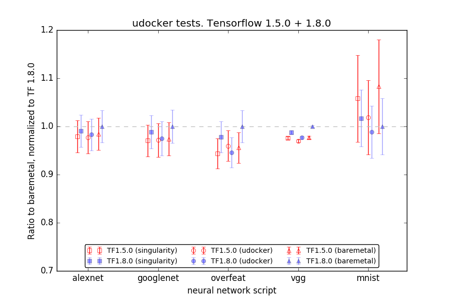

# uDocker new GPU implementation

The use of NVIDIA GPUs for scientific computing requires the deployment of proprietary drivers and libraries.
In order to use the GPUs inside containers, the devices associated to the GPU have to be visible inside the container.
Furthermore, the driver has to be installed in the image and the version has to match the one deployed on the guest host.
This turns the Docker images un-shareable and the image must be built locally for each host.
The alternative is to have an image for each version of the driver, which is un-manageable since at each update,
many images would have to be built. The _uDocker_ released at the end of the Indigo-Datacloud project
does not have such features, as such in order to use GPUs, the image has to have the NVIDIA drivers and
libraries matching the host system. On the other hand, it is not necessary to pass the NVIDIA devices
to the _uDocker_ container since they are visible inside the container, in the same way a non-privileged user
can use those devices in the host system.

The work performed during the first months of the DEEP-HybridDataCloud project, was to implement such automatism.
The development is available in the "devel" branch of the official GitHub repository [1], and scheduled for
the first release of DEEP-HybridDataCloud software stack at the end of October 2018.
The libraries and drivers deployed in the host system are made available to the containers.
This version has been tested under several conditions and by several users and use cases.
The tests performed in the framework of DEEP-HybridDataCloud project WP3 and WP4 are described in the following.

## Test and evaluation of new implementation ##
The following tests and benchmark tools were developed to test performance of the python code packed in a Docker container
and executed by means of _uDocker_ [2]. We compare _uDocker_ performance with baremetal execution and via
Singularity 2.5.2-dist [3]. The benchmark tools are based on official Tensorflow Docker images from the Docker Hub [4]
and deep learning python scripts publicly available at GitHub [5]. All scripts implement convolutional neural networks (CNN)
but of different architecture: AlexNet, GoogLeNet, Overfeat, VGG [6], and one based on Tensorflow example for
the MNIST dataset [7]. The latter processes MNIST data placed inside the Docker container while
others process synthetic data generated on-the-fly. We adapted the scripts for more recent Tensorflow versions and
homogenized the scripts to have a 'burn-in' phase, measure total runtime, mean time per batch and its standard deviation.
In all tests the same version of the python scripts and corresponding Docker images, tagged as '181004' at
both GitHub and Docker Hub [7]  are used. The tests comprise the following:

1.  They are executed on GPU nodes of ForHLR II cluster [8], where each of the nodes contains four 12-core Intel Xeon
processors E7-4830 v3 (Haswell), 1 TB of main memory, 4x960 GB local SSDs, 4 NVIDIA GeForce GTX980 Ti graphic cards.
Operating System is RedHat Enterprise Linux 7.5, CUDA Toolkit 9.0.176 and NVIDIA Driver 384.81 are installed system-wide,
cudnn 7.0.5 is installed in the user's $HOME directory. The test are performed with Python version 2.7.5.
1.  For baremetal performance tests, two Tensorflow GPU versions 1.5.0 and 1.8.0 are installed in separate
virtual environments via pip installation tool.
1.  For _uDocker_ tests, we build two Docker images based on the same Tensorflow versions, 1.5.0 and 1.8.0.
The python scripts and MNIST data are stored inside the images. In both Docker images CUDA Toolkit is 9.0.176,
cudnn version is 7.0.5, and Python is 2.7.12. We use _uDocker_ (devel branch) to pull images from the Docker Hub.
To run the containers, F3 (Fakechroot) mode is set with --nvidia flag (to add NVIDIA libraries and binaries).
1.  For Singularity tests, Docker images built for _uDocker_ tests where converted  to Singularity images and
uploaded to ForHLR II. Singularity version 2.5.2-dist was used. The containers are executed with --nv flag for NVIDIA support.
1.  In all tests, the CNN scripts with synthetic data are executed for 1000 batches, therefore the mean time per batch is averaged over 1000 steps,
the MNIST script is run for 20000 steps.

The results of the tests are shown in Figure 1, where we normalize the mean runtime per batch to the baremetal case
and Tensorflow 1.8.0. Error bars are scaled by the mean time per batch for baremetal and Tensorflow 1.8.0.
The tests do not indicate any penalty in executing the CNN scripts in either container technology _uDocker_ or
Singularity in comparison with baremetal within the statistical uncertainty.
They may even suggest that running the scripts inside containers is slightly faster than in baremetal,
which could be connected to caching of data locally at the node in case of containers but needs to be better understood.
Tensorflow 1.5.0 tends to be a bit faster than Tensorflow 1.8.0 for synthetic data but slower
when real MNIST dataset is processed. This might be interpreted as improved I/O performance in Tensorflow 1.8.0
comparing to 1.5.0.

Figure 1: _uDocker_ performance tests using Tensorflow 1.5.0 and 1.8.0 in comparison with Baremetal installation
in a user directory and Singularity. Lower values indicate better performance.

One job per node is executed in these tests, i.e. only one GPU card of the node is used and three other cards are
not involved. _uDocker_ however allows to pass environment settings inside containers, therefore making it
possible to define which GPU card to use through providing the CUDA_VISIBLE_DEVICES parameter.
It was possible to submit a job to our batch system such that in one job we can instantiate 4 _uDocker_
containers where each container runs on a separate GPU card of the same node. This test does not indicate a degradation
of performance in terms of total runtime and mean runtime per batch but shows significant increase
in the uncertainty of the runtime per batch, especially in the case of the MNIST dataset.

As the tests suggest, it is of interest to study the behavior of processing large datasets from containers.
Therefore we plan to extend our scripts to establish training on e.g. CIFAR datasets [9].
Such training may also require multi-GPU training so that we can preform tests to access all GPU cards
on one node from single container. If our use-cases show interest, we may add other neural network
architectures to the tests, such as Long Short-Term Memory (LSTM) or Generative Adversarial Networks (GAN).

9-Oct-2018

## References ##
1. uDocker official GitHub repository: https://github.com/indigo-dc/udocker
1. Jorge Gomes, Emanuele Bagnaschi, Isabel Campos, MarioDavid, Luís Alves, João Martins, João Pina, Alvaro López-García, PabloOrviz,
"Enabling rootless Linux Containers in multi-user environments: The udocker tool", Computer Physics Communications, Volume 232, 2018,
Pages 84-97, ISSN 0010-4655, https://doi.org/10.1016/j.cpc.2018.05.021.
1. G. M. Kurtzer, V. Sochat, and M. W. Bauer, “Singularity: Scientific containers for mobility of compute,”  PLoS ONE, 2017.
1. Docker Hub tensorflow/tensorflow, https://hub.docker.com/r/tensorflow/tensorflow/
1. convnet-benchmarks: https://github.com/soumith/convnet-benchmarks/tree/master/tensorflow ,
Tensorflow MNIST example: https://github.com/tensorflow/tensorflow/blob/r1.2/tensorflow/examples/tutorials/mnist/mnist_deep.py
1.
   * AlexNet: Krizhevsky, A., Sutskever, I., Hinton, G.E.: Imagenet classification with deep convolutional neural networks (2012),
http://papers.nips.cc/paper/4824-imagenet-classification-with-deep-convolutional-neural-networks.pdf
   * GoogLeNet: C. Szegedy, W. Liu, Y. Jia, P. Sermanet, S. Reed, D. Anguelov, D. Erhan, V. Vanhoucke, A. Rabinovich:
Going Deeper with Convolutions (2015), In Computer Vision and Pattern Recognition (CVPR) [http://arxiv.org/abs/1409.4842]
   * Overfeat: Sermanet, P., Eigen, D., Zhang, X., Mathieu, M., Fergus, R., & Lecun, Y. (2014).
Overfeat: Integrated recognition, localization and detection using convolutional networks. In International Conference on Learning Representations (ICLR2014),
CBLS, April 2014 [http://openreview.net/document/d332e77d-459a-4af8-b3ed-55ba, http://arxiv.org/abs/1312.6229]
   * VGG: Simonyan, K., Zisserman, A.: Very deep convolutional networks for large-scale image recognition.
CoRR abs/1409.1556 (2014), http://arxiv.org/abs/1409.1556
1. tf-benchmarks GitHub: https://github.com/vykozlov/tf-benchmarks/tree/181004, Docker Hub: https://hub.docker.com/r/vykozlov/tf-benchmarks/tags/ , tags 181004-tf150-gpu and 181004-tf180-gpu
1. Computational resource ForHLR II available at Karlsruhe Institute of Technology, https://wiki.scc.kit.edu/hpc/index.php/Category:ForHLR
1. CIFAR-10 and CIFAR-100 datasets, https://www.cs.toronto.edu/~kriz/cifar.html
