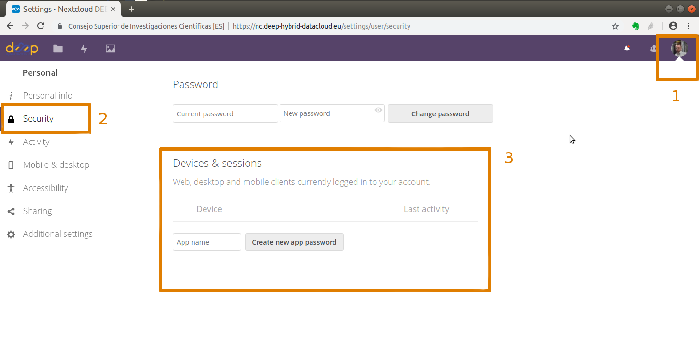

.. include:: <isonum.txt>
.. highlight:: console

******************
How to use rclone
******************

Installation of rclone in Docker image
======================================

All applications in the `DEEP Open Catalog <https://deephdc.github.io/>`_ are packed in a Docker image and have
`rclone <https://rclone.org/>`_ tool installed by default. If you want to create a Docker containing your own application, you should install rclone
in the container to be able to access the data stored remotely. The following lines are an example of what has to be
added in the Dockerfile when installation is based on Ubuntu. For other Linux flavors, please, refer to
the `rclone official site  <https://rclone.org/downloads/>`_  ::

	# Install rclone
	RUN wget https://downloads.rclone.org/rclone-current-linux-amd64.deb && \
	    dpkg -i rclone-current-linux-amd64.deb && \
	    apt install -f && \
	    mkdir /srv/.rclone/ && touch /srv/.rclone/rclone.conf && \
	    rm rclone-current-linux-amd64.deb && \
	    apt-get clean && \
	    rm -rf /var/lib/apt/lists/* && \
	    rm -rf /root/.cache/pip/* && \
	    rm -rf /tmp/*

.. tip::
    When developing an application with the :ref:`Data Science template <user/overview/cookiecutter-template:DEEP Data Science template>`, 
    the Dockerfile already includes installation of rclone.

Nextcloud configuration for rclone
==================================

After login into `DEEP-Nextcloud  <https://nc.deep-hybrid-datacloud.eu/login>`_ with your DEEP-IAM credentials, go to
(1) **Settings (top right corner)** |rarr|  (2) **Security**  |rarr|  (3) **Devices & sessions**. Set a name for your
application and click on **Create new app password**. You get <user> and <password> credentials. Next, you need to obscure the <password> for use in the rclone config file (``rclone.conf``). For this you do:

	$ rclone obscure <password>
	
This <obscure password> and <user> is what one needs to include in the ``rclone.conf`` to run locally or as ``rclone_user`` and ``rclone_password`` either in the Dashboard webform or in the orchent script to generate the deployment when running remotely (see :doc:`here <train-model-locally>` and :doc:`here <train-model-remotely>`).

Creating rclone.conf for your local host
========================================

You can install rclone at your host or run Docker image with rclone installed (see installation steps of rclone above).
In order to create the configuration file (``rclone.conf``) for rclone::

    $ rclone config
   	 choose "n"  for "New remote"
   	 choose name for DEEP-Nextcloud, e.g. deep-nextcloud
   	 choose "Type of Storage" \u2192 "Webdav" (24)
   	 provide DEEP-Nextcloud URL for webdav access: https://nc.deep-hybrid-datacloud.eu/remote.php/webdav/
   	 choose Vendor, Nextcloud (1)
   	 specify "user" (see "Nextcloud configuration for rclone" above). Your username starts with "DEEP-IAM-..."
   	 specify password (see "Nextcloud configuration for rclone" above).
   	 by default rclone.conf is created in your $HOME/.config/rclone/rclone.conf

.. important::
    The rclone.conf file should be in your host, i.e. outside of container. **DO NOT STORE IT IN THE CONTAINER**

Then one has two options:

If you know under what user your run your application in the container (e.g. if docker or nvidia-docker is used, most
probably this is 'root') you can mount your host ``rclone.conf`` into the container as::

    $ docker run -ti -v $HOSTDIR_WITH_RCLONE_CONF/rclone.conf:/root/.config/rclone/rclone.conf <your-docker-image>

i.e. you mount ``rclone.conf`` file itself directly as a volume.

One can also mount rclone directory with the ``rclone.conf`` file::

  	$ docker run -ti -v $HOSTDIR_WITH_RCLONE_CONF:/root/.config/rclone <your-docker-image>

A more reliable way can be to mount either rclone directory or directly ``rclone.conf`` file into a pre-defined location
and not (container) user-dependent place::

    $ docker run -ti -v $HOSTDIR_WITH_RCLONE_CONF:/rclone <your-docker-image>

One has, however, to call rclone with ``--config`` option to point to the ``rclone.conf`` file, e.g::

    $ rclone --config /rclone/rclone.conf ls deep-nextcloud:/Datasets/dogs_breed/models

Example code on usage of rclone from python
===========================================

Simple example
--------------

A simple call of rclone from python is via ``subprocess.Popen()``

.. code-block:: python

    import subprocess

    # from "rshare" remote storage into the container
    command = (['rclone', 'copy', 'rshare:/Datasets/dogs_breed/data', '/srv/dogs_breed_det/data'])

    result = subprocess.Popen(command, stdout=subprocess.PIPE, stderr=subprocess.PIPE)
    output, error = result.communicate()

.. important::
    When deploying a module on the DEEP Pilot testbed, you pass rclone parameters e.g. ``rclone_user`` and ``rclone_password`` during the deployment. 
    If you use our `general template <https://github.com/indigo-dc/tosca-templates/blob/master/deep-oc/deep-oc-marathon-webdav.yml>`_ , the name of the remote storage has to be ``rshare`` as in the example above (``rshare:/Datasets/dogs_breed/data``). If you create your own TOSCA template, you need to pay attention on matching these names in your code and in the template (for example, see environment parameters in the `general template <https://github.com/indigo-dc/tosca-templates/blob/master/deep-oc/deep-oc-marathon-webdav.yml>`_ like RCLONE_CONFIG_RSHARE_USER etc).

Advanced examples
-----------------

More advanced usage includes calling rclone with various options (ls, copy, check) in order to check file existence at
Source, check if after copying two versions match exactly.

* rclone_call

.. code-block:: python

    def rclone_call(src_path, dest_dir, cmd = 'copy', get_output=False):
        """ Function
           rclone calls
        """
         if cmd == 'copy':
            command = (['rclone', 'copy', '--progress', src_path, dest_dir])
         elif cmd == 'ls':
            command = (['rclone', 'ls', src_path])
         elif cmd == 'check':
            command = (['rclone', 'check', src_path, dest_dir])

         if get_output:
            result = subprocess.Popen(command, stdout=subprocess.PIPE, stderr=subprocess.PIPE)
         else:
             result = subprocess.Popen(command, stderr=subprocess.PIPE)
         output, error = result.communicate()
         return output, error

* rclone_copy

.. code-block:: python

    def rclone_copy(src_path, dest_dir, src_type='file', verbose=False):
        """ Function for rclone call to copy data (sync?)
        :param src_path: full path to source (file or directory)
        :param dest_dir: full path to destination directory (not file!)
        :param src_type: if source is file (default) or directory
        :return: if destination was downloaded, and possible error 
        """
    
        error_out = None
    
        if src_type == 'file':
            src_dir = os.path.dirname(src_path)
            dest_file = src_path.split('/')[-1]
            dest_path = os.path.join(dest_dir, dest_file)
        else:
            src_dir = src_path
            dest_path =  dest_dir

        # check first if we find src_path
        output, error = rclone_call(src_path, dest_dir, cmd='ls')
        if error:
            print('[ERROR, rclone_copy()] %s (src):\n%s' % (src_path, error))
            error_out = error
            dest_exist = False
        else:
            # if src_path exists, copy it
            output, error = rclone_call(src_path, dest_dir, cmd='copy')
            if not error:       
                output, error = rclone_call(dest_path, dest_dir,
                                            cmd='ls', get_output=True)
                file_size = [ elem for elem in output.split(' ') if elem.isdigit() ][0]
                print('[INFO] Copied to %s %s bytes' % (dest_path, file_size))
                dest_exist = True
                if verbose:
                    # compare two directories, if copied file appears in output
                    # as not found or not matching -> Error
                    print('[INFO] File %s copied. Check if (src) and (dest) really match..' % (dest_file))
                    output, error = rclone_call(src_dir, dest_dir, cmd='check')
                    if 'ERROR : ' + dest_file in error:
                        print('[ERROR, rclone_copy()] %s (src) and %s (dest) do not match!' 
                              % (src_path, dest_path))
                        error_out = 'Copy failed: ' + src_path + ' (src) and ' + \
                                     dest_path + ' (dest) do not match'
                        dest_exist = False     
            else:
                print('[ERROR, rclone_copy()] %s (src):\n%s' % (dest_path, error))
                error_out = error
                dest_exist = False

        return dest_exist, error_out
