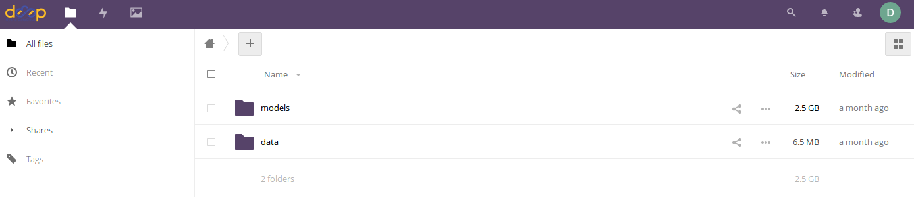
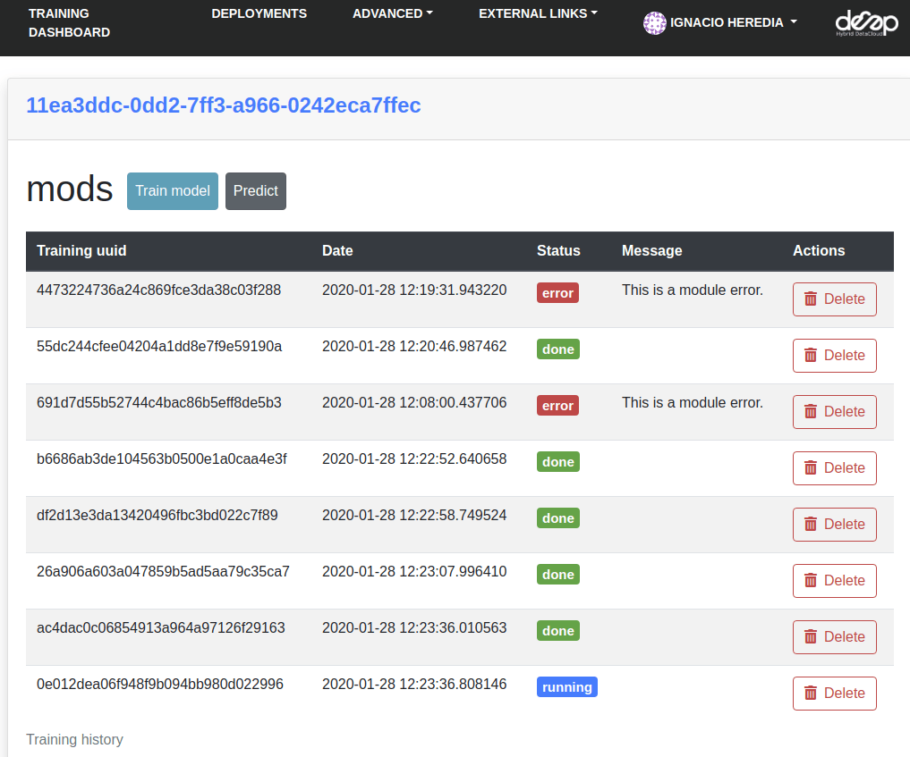

.. include:: <isonum.txt>
.. highlight:: console

Train a model remotely
======================

.. raw:: html

    

        <iframe src="https://www.youtube.com/embed/W1bPmUhzYFY" frameborder="0" allowfullscreen style="position: absolute; top: 0; left: 0; width: 100%; height: 100%;"></iframe>
    

This is a step by step guide on how to train a general model from the `DEEP Marketplace <https://marketplace.deep-hybrid-datacloud.eu/>`__
with your own dataset, in the :doc:`DEEP Dashboard <../overview/dashboard>`.

In this tutorial we will see how to retrain a `generic image classifier <https://github.com/deephdc/DEEP-OC-image-classification-tf>`__
on a custom dataset to create a `phytoplankton classifier <https://github.com/deephdc/DEEP-OC-phytoplankton-classification-tf>`__.
If you want to follow along, you can download the toy phytoplankton dataset :fa:`download` `here <https://api.cloud.ifca.es:8080/swift/v1/public-datasets/phytoplankton-mini.zip>`__.

.. admonition:: Requirements

    * You need  a `DEEP-IAM <https://iam.deep-hybrid-datacloud.eu/>`__ account to be able to access the Dashboard and Nextcloud storage.
    * For **Step 7** we recommend having `docker <https://docs.docker.com/install/#supported-platforms>`__ installed (though it's not strictly mandatory).

1. Choose a module from the Marketplace
---------------------------------------

The first step is to choose a model from the `DEEP Open Catalog marketplace <https://marketplace.deep-hybrid-datacloud.eu/>`__. Make sure to select a module with the ``trainable`` tag.
For educational purposes we are going to use a `general model to identify images <https://marketplace.deep-hybrid-datacloud.eu/modules/train-an-image-classifier.html>`__.
Some of the model dependent details can change if using another model, but this tutorial will provide
a general overview of the workflow to follow when using any of the models in the Marketplace.

2. Upload your files to Nextcloud
---------------------------------

For this example we are going to use `DEEP-Nextcloud <https://data-deep.a.incd.pt/>`__ for storing
the dataset you want to retrain the model with.

So login to Nextcloud with your DEEP-IAM credentials and you should access to an overview of your files.
Now it's time to upload your dataset.
When training a model, the data has usually to be in a specific format and folder structure.
It's usually helpful to read the README in the source code of the module
(in this case located `here <https://github.com/deephdc/image-classification-tf>`__)
to learn the correct way to setting it up.

In the case of the **image classification module**, we will create the following folders:

* A folder called ``models`` where the new training weights will be stored after the training is completed
* A folder called ``data`` that contains two different folders:

    * The sub folder ``images`` containing the input images needed for the training
    * The sub folder ``dataset_files`` containing a couple of files:

        * ``train.txt`` indicating the relative path to the training images
        * ``classes.txt`` indicating which are the categories for the training

Again, the folder structure and their content will of course depend on the module to be used.
This structure is just an example in order to complete the workflow for this tutorial.

Once you have prepared your data locally, you can drag your folder to the Nextcloud Web UI to upload it.
jhdfjhdjfhhdjfhjdhfhjfjdhfjhdjfhjdhfjhdfhjdfjhdjfhjdhfjdhfjhdfjhdjhfjdhfjhjdhfjhdjfhjdfhjdhfjhdjfhjdhfjdhfjhdjfhdjfhjhfjdhdjfhjdhfjdhfjhdfjhjdfhjdfhjdfjhdjfhdjfhjdhfjdhfjhdjfhjdfjfdhjhfdjhjfhdjhfjdhjdhfjhdjfhdjfhjdfjdhfjhdfjhjdfhjhjfdhjhfjdhfjhfdjhfjdhjdhfjhfdjdhfjhdjfjhjhfdjhfdhjhfdjhfjdhfjdhfjhjdfhjdfjdfhfdjhfdjhjdhfjhfd
.. tip::

    Uploading to Nextcloud can be particularly slow if your dataset is composed of lots of small files.
    Considering zipping your folder before uploading.

    .. code-block:: console

        $ zip -r <foldername>.zip <foldername>
        $ unzip <foldername>.zip

3. Deploy with the Training Dashboard
-------------------------------------

Now go to the `Training Dashboard <https://train.deep-hybrid-datacloud.eu/>`__  and login with your DEEP-IAM credentials.
Then go to (1) **Modules (marketplace)** ➜ (2) **Train image classifier** ➜ (3) **Train module**.

Now you will be presented with a configuration form.
For the purposes of running a retraining, it should be filled as following:

1. In the **General configuration** you should select:

* ``Template = default (with storage options)``, unless stated otherwise in your modules README.
* ``Command = JupyterLab`` because we want the flexibility of being able to interact with the code and the terminal, not just the API.
* ``Hardware configuration = GPU`` because training is a very resource consuming task.
* ``Docker tag = gpu`` because Docker tag has to match the hardware it will be run on.

2. Once this is set, you can proceed to fill the **Specific configuration**:

* ``jupyter password``, you have to provide a password at least 9 characters long, so that nobody will be able to access your machine, which will be exposed on a public IP.
* ``rclone_user``, ``rclone_password``: those are the credentials to be able to mount your Nextcloud directory in your deployment.
  :ref:`Go here <user/howto/rclone:Configuring rclone>` in order to find how to create them.

Now that you are done configuring, click **Submit** to create the deployment.
See the :doc:`Dashboard guide <../overview/dashboard>` for more details.

4. Go to JupyterLab and mount your dataset
------------------------------------------

After submitting you will be redirected to the deployment's list.
In your new deployment go to **Access** and choose **JupyterLab**. You will be redirected to ``http://jupyterlab_endpoint``

Now that you are in JupyterLab, open a **Terminal** window (:fa:`square-plus` (New launcher) ➜ **Others** ➜ **Terminal**).

First let's check we are seeing our GPU correctly:

.. code-block:: console

    $ nvidia-smi

This should output the GPU model along with some extra info.
We can also check rclone is correctly configured with:

.. code-block:: console

    $ rclone about rshare:

which should output your used space in Nextcloud.

.. tip::
    If you happen to need additional packages, you will have to update the package index first.
    Note that sudo is not needed as you are always root in your Docker containers:

    .. code-block:: console

        $ apt update
        $ apt install vim

Now we will mount our remote Nextcloud folders in our local containers:

.. code-block:: console

    $ rclone copy rshare:/data/dataset_files /srv/image-classification-tf/data/dataset_files
    $ rclone copy rshare:/data/images /srv/image-classification-tf/data/images

Paths with the ``rshare`` prefix are Nextcloud paths.
As always, paths are specific to this example. Your module might need different paths.
If you zipped your files before uploading to Nextcloud you will have to ``rclone copy`` the ``zip`` file,
unzip it and copy the contents to the appropriate folders.

Mounting your dataset *might take some time*, depending on the dataset size, file structure (lots of small files vs few big files), and so on.
So grab a cup of coffee and prepare for the next steps.

Now that you dataset is mounted, we will run DEEPaaS to interactively run the training. In your terminal window type:

.. code-block:: console

    $ nohup deep-start --deepaas &

The ``&`` will keep your command running even if you close the terminal, and ``nohup`` will produce a log file
``nohup.out`` that you can always look at if you want to know what is going on under the hood.

5. Open the DEEPaaS API and train the model
-------------------------------------------

Now go back to the deployments list view.
In your deployment go to **Access** and choose **DEEPaaS**. You will be redirected to ``http://deepaas_endpoint/ui``.

.. image:: ../../_static/deepaas.png
   :width: 500 px

Look for the ``train`` POST method. Modify the training parameters you wish to change and execute.

If some kind of monitorization tool is available for the module, you will be able to follow the training
progress at ``http://monitor_endpoint`` (click **Access** button ➜ **Monitoring**, in the deployments page).

In **Access** ➜ **History** you will be able to see the status of your current training as well as old ones.

6. Test and export the newly trained model
------------------------------------------

Once the training has finished, you can directly test it by clicking on the ``predict`` POST method.
For this you have to kill the process running deepaas, and launch it again.

.. code-block:: console

    $ kill -9 $(ps aux | grep '[d]eepaas-run' | awk '{print $2}')
    $ kill -9 $(ps aux | grep '[t]ensorboard' | awk '{print $2}')  # optionally also kill monitoring process

This is because the user inputs for deepaas are generated at the deepaas launching.
Thus it is not aware of the newly trained model. Once deepaas is restarted, head to the
``predict`` POST method, select you new model weights and upload the image your want to classify.

If you are satisfied with your model, then it's time to save it into your remote storage,
so that you still have access to it if your machine is deleted.
For this we have to create a ``tar`` file with the model folder (in this case, the foldername is
the timestamp at which the training was launched) so that we can download in our Docker container.

So go back to JupyterLab, open a Terminal window and run:

.. code-block:: console

    $ cd /srv/image-classification-tf/models
    $ tar cfJ <modelname.tar.xz> <foldername>
    $ rclone copy /srv/image-classification-tf/models rshare:/models

Now you should be able to see your new models weights in Nextcloud.

For the next step, you need to make them `publicly available <https://docs.nextcloud.com/server/latest/user_manual/en/files/sharing.html>`__
through an URL so they can be downloaded in your Docker container.
In Nextcloud, go to the ``tar`` file you just created:
:fa:`share-nodes` ➜ Share Link ➜ :fa:`square-plus` (Create a new share link)

7. Create a Docker repo for your new module
-------------------------------------------

Now, let's say you want to share your new application with your colleagues.
The process is much simpler that when :doc:`developing a new module from scratch <develop-model>`,
as your code is the same as the original application, only your model weights
are different.

To account for this simpler process, we have prepared a version of the
:doc:`the DEEP Modules Template <../overview/cookiecutter-template>`
specially tailored to this task.

In your **local machine** (not the Dashboard deployment), run the Template with the ``child-module`` branch.

.. code-block::

    $ pip install cookiecutter
    $ cookiecutter https://github.com/deephdc/cookiecutter-deep --checkout child-module

Proceed to answer the questions you will be prompted.
This will create a single repo (``DEEP-OC-**``) with the Docker code.

Now:

**(1)** Modify ``metadata.json`` with the proper description of your new module.
This is the information that will be displayed in the Marketplace.
Check you didn't mess up the JSON formatting by running:

.. code-block:: console

    $ pip install git+https://github.com/deephdc/schema4apps
    $ deep-app-schema-validator metadata.json

**(2)** Then go to the ``Dockerfile``. You will see that the base Docker image
is the image of the original repo. Modify the appropriate lines to replace
the original model weights with the new model weights.
In our case, this could look something like this:

.. code-block:: docker

    ENV SWIFT_CONTAINER https://data-deep.a.incd.pt/index.php/s/r8y3WMK9jwEJ3Ei/download
    ENV MODEL_TAR phytoplankton.tar.xz

    RUN rm -rf image-classification-tf/models/*
    RUN curl --insecure -o ./image-classification-tf/models/${MODEL_TAR} \
        ${SWIFT_CONTAINER}/${MODEL_TAR}
    RUN cd image-classification-tf/models && \
        tar -xf ${MODEL_TAR} &&\
        rm ${MODEL_TAR}

Check your Dockerfile works correctly by building it locally and running it:

  .. code-block:: console

    $ docker build --no-cache -t your_project .
    $ docker run -ti -p 5000:5000 -p 6006:6006 -p 8888:8888 your_project

Your module should be visible in http://0.0.0.0:5000/ui

Once you are fine with the state of your module, got to Github to create the repo
``https://github.com/<github-user>/DEEP-OC-<project-name>`` and push the changes.

8. Share your new module in the Marketplace
-------------------------------------------

Once your repo is set, it's time to make a PR to add your model to the marketplace!

For this you have to fork the code of the DEEP catalog repo (`deephdc/deep-oc <https://github.com/deephdc/deep-oc>`__)
and add your Docker repo name at the end of the ``MODULES.yml``.

.. code-block:: yaml

    - module: https://github.com/deephdc/UC-<github-user>-DEEP-OC-<project-name>

You can do this directly `online on GitHub <https://github.com/deephdc/deep-oc/edit/master/MODULES.yml>`__ or via the command line:

.. code-block:: console

    $ git clone https://github.com/[my-github-fork]
    $ cd [my-github-fork]
    $ echo '- module: https://github.com/deephdc/UC-<github-user>-DEEP-OC-<project-name>' >> MODULES.yml
    $ git commit -a -m "adding new module to the catalogue"
    $ git push

Once the changes are done, make a PR of your fork to the original repo and wait for approval.
Check the `GitHub Standard Fork & Pull Request Workflow <https://gist.github.com/Chaser324/ce0505fbed06b947d962>`__ in case of doubt.

When your module gets approved, you may need to commit and push a change to ``metadata.json``
in your ``https://github.com/<github-user>/DEEP-OC-<project-name>`` so that
`the Pipeline <https://github.com/deephdc/DEEP-OC-demo_app/blob/726e068d54a05839abe8aef741b3ace8a078ae6f/Jenkinsfile#L104>`__
is run for the first time, and your module gets rendered in the marketplace.

9. [optional] Add your new module to the original Continuous Integration pipeline
---------------------------------------------------------------------------------

Your module is already in the Marketplace.
But what happens if the code in the original image-classification module changes?
This should trigger a rebuild of your Docker container as it is based on that code.

This can be achieved by modifying the ``Jenkinsfile`` in the `image-classification Docker repo <https://github.com/deephdc/DEEP-OC-image-classification-tf/blob/master/Jenkinsfile>`__.
One would add an additional stage to the Jenkins pipeline like so:

.. code-block::

    stage("Re-build DEEP-OC Docker images for derived services") {
        when {
            anyOf {
               branch 'master'
               branch 'test'
               buildingTag()
            }
        }
        steps {

            // Wait for the base image to be correctly updated in DockerHub as it is going to be used as base for
            // building the derived images
            sleep(time:5, unit:"MINUTES")

            script {
                def derived_job_locations =
                ['Pipeline-as-code/DEEP-OC-org/DEEP-OC-plants-classification-tf',
                 'Pipeline-as-code/DEEP-OC-org/DEEP-OC-conus-classification-tf',
                 'Pipeline-as-code/DEEP-OC-org/DEEP-OC-seeds-classification-tf',
                 'Pipeline-as-code/DEEP-OC-org/DEEP-OC-phytoplankton-classification-tf'
                 ]

                for (job_loc in derived_job_locations) {
                    job_to_build = "${job_loc}/${env.BRANCH_NAME}"
                    def job_result = JenkinsBuildJob(job_to_build)
                    job_result_url = job_result.absoluteUrl
                }
            }
        }
    }

So if you want this step to be performed, you must submit a PR to the original module Docker repo with similar changes as above.
