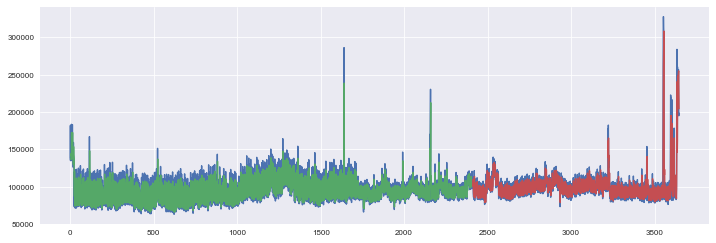
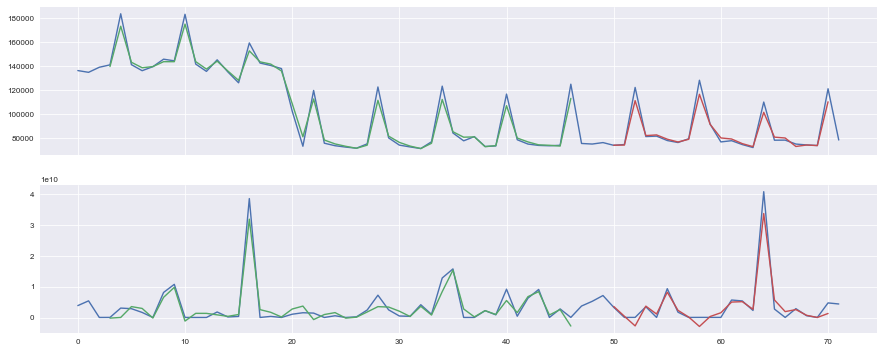

DEEP Open Catalogue: Massive Online Data Streams (MODS)
=======================================================

This is a service to analyze online data streams in order to generate alerts in real-time. 
Its intelligent module core part is built as 
machine learning application using deep learning techniques for modelling 
in co-function with underlying Intrusion Detection Systems supervising network traffic 
of computing infrastruture. 
The service is running on TensorFlow backend. 

Further references like articles and presentations of this module are available 
in the `git repository <https://github.com/deephdc/mods/tree/master/references>`_.

+-----------------------------------------------------------------+---------------------------------+
| Data Science application                                        | machine learning, deep learning |
+-----------------------------------------------------------------+---------------------------------+
| Deep Learning Framework(s)                                      | Tensorflow, Keras               |
+-----------------------------------------------------------------+---------------------------------+
| Programming language                                            | Python                          |
+-----------------------------------------------------------------+---------------------------------+
| GPU version                                                     | yes                             |
+-----------------------------------------------------------------+---------------------------------+
| CPU version                                                     | yes                             |
+-----------------------------------------------------------------+---------------------------------+
| `DEEPaaS API <https://deepaas.readthedocs.io/en/stable/>`_      | yes                             |
+-----------------------------------------------------------------+---------------------------------+ 
| :doc:`DEEP DS template <../overview/cookiecutter-template>`     | yes                             |
+-----------------------------------------------------------------+---------------------------------+
| `DEEP-Nextcloud <https://nc.deep-hybrid-datacloud.eu/>`_ access | yes                             |
+-----------------------------------------------------------------+---------------------------------+

Keywords: machine learning, deep learning, deep neural networks, recurrent neural networks, cyber security, anomaly detection, time-series forecasting, Tensorflow

DEEP-OC DockerHub image: https://hub.docker.com/r/deephdc/deep-oc-mods

DEEP-OC Dockerfile: https://github.com/deephdc/DEEP-OC-mods

Application source code: https://github.com/deephdc/mods

Description
-----------

The challenge of the proactive network monitoring solution is about the cooperation of scalable 
edge technologies supporting extensive data analysis, large-scale data processing and 
deep learning modelling to improve the cyber security resilience for computing infrastrutures.
Our proactive network monitoring solution comprises of the intelligent module 
(with MODS abbreviation) and its data processing (DS) module. 
The DS source code as well as raw data are not publicly available due to security sensitiveness. 
The ML/DL datapools for MODS module is available at the Open Source public 
`repository <https:digital.csic.es>`_

The MODS module uses deep learning for modeling. It focuses on abnormal state detection 
in the mean of security protection for computing infrastructure. 
The principle is based on proactive time-series ferecasting adopting deep neural networks 
to provide a near future behaviour estimation of multiple simultaneous monitoring channels 
based on the knowledge base of past activities. An ongoing network activity is expected to present 
a monitoring anomaly, where anomaly stands for a behaviour that deviates from the standard, normal 
or expected activity states.

Workflow
^^^^^^^^

The data processing (DS) module prepares datasets for machine learning purpose through standard 
ML steps like data filtering, data cleaning, feature extraction, feature selection for datapool building. 

The MODS workflow goes through configuration specification for training and hyperparameter setting, 
then model training and model testing. The MODS workflow is fully supported by the DEEP as Service 
and DEEP learning facility in DEEP stack as well as comfortable local testing. 
It supposes usage of downloaded from 
`DEEP Open Catalog <https://marketplace.deep-hybrid-datacloud.eu/>`_ docker images, 
i.e. you need either 
`docker <https://docs.docker.com/install/#supported-platforms>`_ or 
`udocker <https://github.com/indigo-dc/udocker/releases>`_ tool.

Fig. 1 Train and test on 6 month monitoring dataset. 
Blue=dataset, green=prediction on train dataset, red=prediction on test (unseen) dataset.

Fig. 2 Train and test on three day dataset for better visualisation for two channels simultaneously.
Blue=dataset, green=prediction on train dataset, red=prediction on test (unseen) dataset.

The MODS module is fully and ready to be used leveraging the DEEPaaS API (see below).

Launching the full DEEPaas API
------------------------------

1. Prediction through DEEPaaS API
^^^^^^^^^^^^^^^^^^^^^^^^^^^^^^^^^

You can easily and locally try the default configuration by start the container as::

    $ docker run -ti -p 5000:5000 deephdc/deep-oc-mods   
       
* Direct your web browser to the local endpoint http://localhost:5000 to get the OpenAPI (Swagger) 

* Go to ``POST /models/mods/predict`` for prediction, click ``Try it out`` button

* Go to ``Data file``, select some ``.tsv`` file containing observations like `here <https://github.com/deephdc/mods/blob/master/data/test/sample-test-w01h-s10m.tsv>`_. 

* Go to ``Model name``, select a model e.g., ``model_default_cpu.zip``

* Click ``Execute`` and get predicted values in JSON format.

.. note:: All available default models are packed in ``.zip`` containing the model, scaler, config and trained metrics. The model has to be trained with train data (e.g., built from datapool) in the same format as data file used for prediction.

* If you want to build the container directly in your machine, follow the instructions in `DEEP-OC Dockerfile <https://github.com/deephdc/DEEP-OC-mods>`_.

* Prediction through DEEPaaS API in DEEP stack is easy and similar as locally. After starting MODS container in DEEP stack, go to the assigned DEEPaaS endpoint instead of the local endpoint and continue above described steps.

2. Train through DEEPaaS API in DEEP stack
^^^^^^^^^^^^^^^^^^^^^^^^^^^^^^^^^^^^^^^^^^

After starting MODS container in DEEP stack, you can easily retraining MODS model with the default 
datapool, which is located in your DEEP-NextCloud space ``nc:/mods/data/features/`` as follows:
     
* Direct your web browser to the assigned DEEPaaS endpoint

* Go to ``PUT /models/mods/train`` for retrain, click ``Try it out`` button

* Specified new values for retrain if needed.

* Click ``Execute``, wait for model retraining in DEEP pilot infrastructure and get new retrained model located in your DEEP-NextCloud space ``nc:/mods/models/``.

.. note:: New retrained model is packed in ``.zip`` containing the model, scaler, config and trained metrics.

3. DEEPaaS API functionality
^^^^^^^^^^^^^^^^^^^^^^^^^^^^

To access this package's complete functionality (both for train and prediction) 
through the DEEPaaS API, follow the instructions here: :ref:`api-integration`
