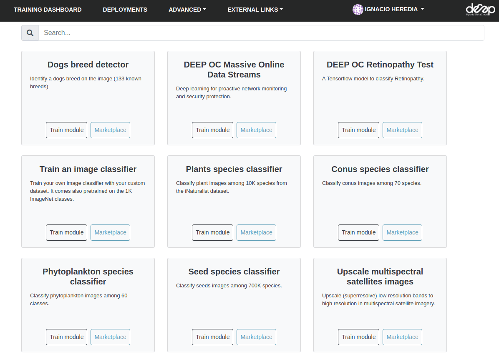
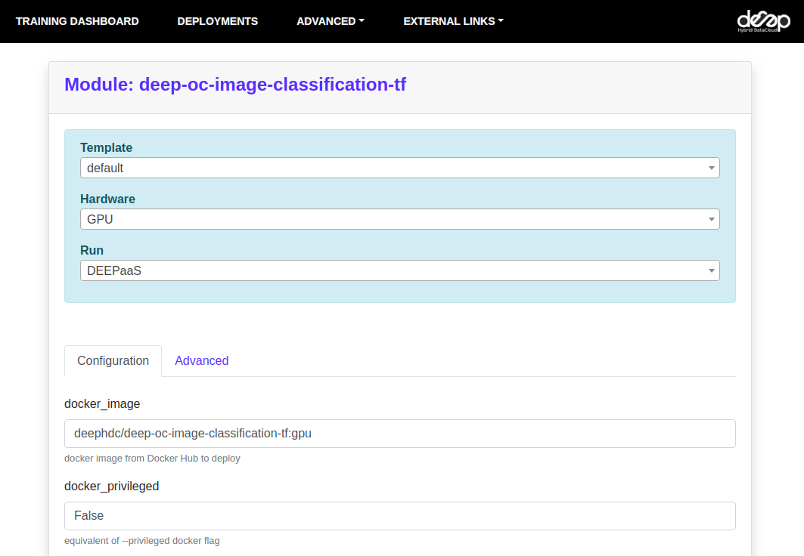
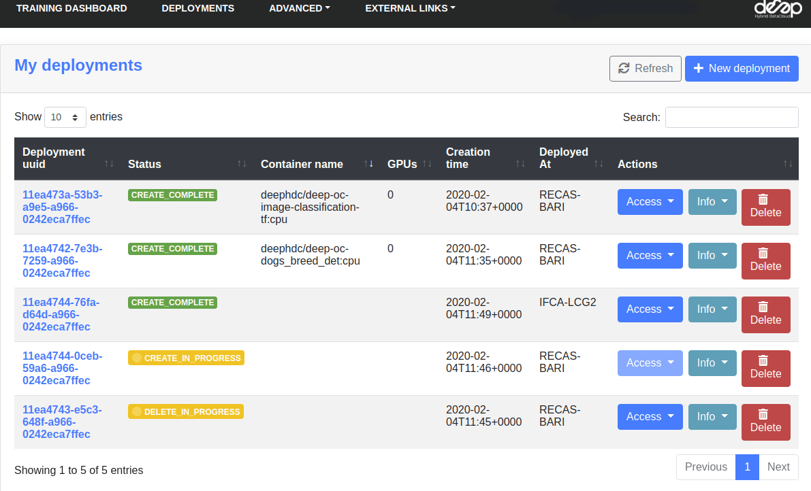

DEEP Dashboard
==============

The DEEP dashboard allow users to access computing resources to deploy, perform inference, and train their modules.
To be able to access the Dashboard you need `IAM credentials <https://iam.deep-hybrid-datacloud.eu/>`_.
There are two versions of the Dashboard:

* `Training dashboard <https://train.deep-hybrid-datacloud.eu/>`_
    This dashboard allows you to interact with the modules hosted at the `DEEP Open Catalog <https://marketplace.deep-hybrid-datacloud.eu/>`_,
    as well as deploying external Docker images hosted in Dockerhub. It simplifies the deployment and hides some of
    the technical parts that most users do not need to worry about. *Most of DEEP users would use this dashboard*.

* `General purpose dashboard <https://paas.cloud.cnaf.infn.it/>`_
    This dashboard allows you to interact with the underling `TOSCA templates <https://github.com/indigo-dc/tosca-templates/tree/master/deep-oc>`_
    (which configure the job requirements) instead of modules and deploy more complex topologies (e.g. a kubernetes cluster).
    Modules can either use a `general template <https://github.com/indigo-dc/tosca-templates/blob/master/deep-oc/deep-oc-marathon-webdav.yml>`_
    or create a dedicated one based on the `existing templates <https://github.com/indigo-dc/tosca-templates/tree/master/deep-oc>`__.

We will present the features of the Training Dashboard as it is the one that most users will interact with.

Selecting the modules
=====================

Once you log into the Dashboard, you can browse through all the Marketplace modules of you can deploy.
It also possible to deploy external docker images that are not hosted in the
`deephdc organization <https://hub.docker.com/u/deephdc/>`_ (that is from modules not available in the
Marketplace) at "Run your own module", as well as deploying a "Development module" to develop some code.

Making a deployment
===================

Once you choose the module to deploy click in Train module. This allow a user to select:

* **The computing resources** to have available. A user can select multiple CPUs and GPUs, the machine RAM as well as
  optionally choosing the physical site where the machine must be deployed.
* **The service** to run. Currently, options include running the :doc:`DEEPaaS API <api>` (recommended for fully
  developed modules than only need to be trained) and `JupyterLab <https://jupyterlab.readthedocs.io/en/stable/>`_
  (recommended for developing code as well for cases where access to the bash console is needed).

Click **Submit** and you will be redirected to the page listing all the current deployments.

.. note::
  It is also possible to make deployments via the :doc:`command line interface <../howto/deploy-orchent>`

Managing the deployments
========================

In the Deployments tab you have a view of all the deployments you have made:

If you click on the UUID of the deployments you can access the deployments personal page where you can view things such
as the training history, as long as your deployment is using DEEPaaS V2:

.. image:: ../../_static/dashboard-history.png
