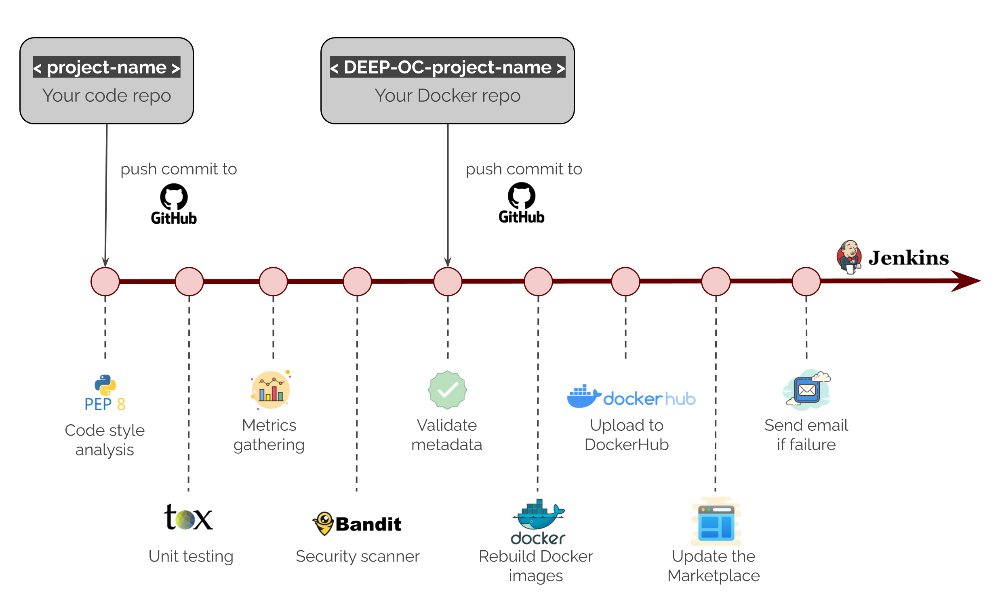

Modules
=======

All  modules are found at the `DEEP Marketplace <https://marketplace.deep-hybrid-datacloud.eu/>`_, the source code is
hosted under `Github's deephdc <https://github.com/deephdc>`__ organization and the corresponding Docker images are
hosted under `DockerHub's deephdc <https://hub.docker.com/u/deephdc/>`__ organization.

Modules developed by **deephdc members** follow the following convention:

* ``deephdc/<project-name>``: source code of the module
* ``deephdc/DEEP-OC-<project-name>``: Dockerfiles and metadata of that module.

Modules developed by **external users** follow the following convention:

* ``deephdc/UC-<github-user>-<project-name>``: source code of the module
* ``deephdc/UC-<github-user>-DEEP-OC-<project-name>``: Dockerfiles and metadata of that module.

Docker images have usually tags depending on whether they are using Github's ``master`` or ``test`` and
whether they use ``cpu`` or ``gpu``. Tags are usually:

* ``latest`` or ``cpu``: master + cpu
* ``gpu``: master + gpu
* ``cpu-test``: test + cpu
* ``gpu-test``: test + gpu

CI /CD pipeline
---------------

In the project we use `Jenkins <https://jenkins.indigo-datacloud.eu/job/Pipeline-as-code/job/DEEP-OC-org/>`__
for implementing CI/CD (Continuous Integration / Continuous Development) pipeline. This pipeline automatically performs a
series of actions for you each time you commit a change in your code. This ensures that all the information and builds
across the project are always up-to-date with your code.

This is an example of actions tha are performed by the pipeline:

The steps are defined in the ``Jenkinsfile`` of your repos.
