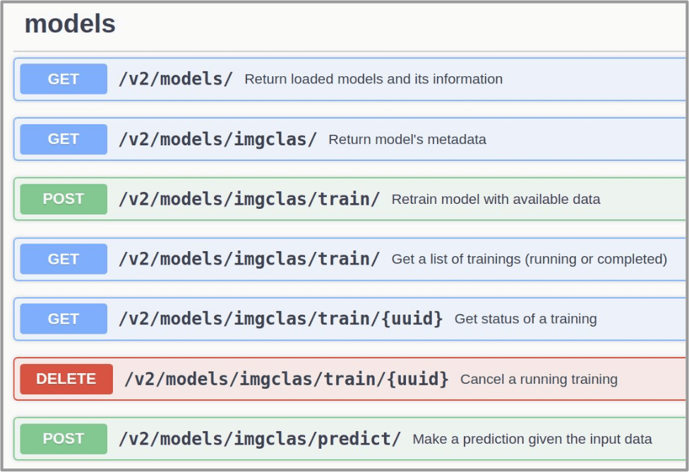

=================
Quickstart Guide
=================

.. todo:: Provide information on (at least):

   1. How to download and test a model (i.e. get docker, go to the marketplace, get the model, run it).

   2. Use cookiecutter to develop a model

   3. Integrate an existing model with DEEPaaS

   4. Create a container from a model

Download model from the marketplace
-----------------------------------

#. go to `DEEP Open Catalog <https://deephdc.github.io/>`_
#. `Browse <https://deephdc.github.io/#model-list>`_ available models
#. Find the model and get it either from `Docker hub <https://hub.docker.com/u/deephdc>`_ (easy) or `github <https://github.com/topics/deep-hybrid-datacloud>`_ (pro)

Run downloaded model locally
----------------------------

.. _docker-hub-way:

Docker Hub way (easy)
^^^^^^^^^^^^^^^^^^^^^
**Prerequisites:** either `docker <https://docs.docker.com/install/#supported-platforms>`_  
(+ `nvidia-docker <https://github.com/nvidia/nvidia-docker/wiki/Installation-(version-2.0)>`_ for GPU support) or 
`udocker <https://github.com/indigo-dc/udocker/releases>`_ (GPU support is implemented)

1. To run the Docker container directly from Docker Hub and start using the `API <https://github.com/indigo-dc/DEEPaaS>`_ simply run the following:

    Via docker command::

        $ docker run -ti -p 5000:5000 deephdc/deep-oc-model_of_interest

    With GPU support::

        $ nvidia-docker run -ti -p 5000:5000 deephdc/deep-oc-model_of_interest
    
    Via udocker::

        $ udocker run -p 5000:5000 deephdc/deep-oc-model_of_interest
    
    Via udocker with GPU support::

        $ udocker pull deephdc/deep-oc-model_of_interest
        $ udocker create --name=model_of_interest deephdc/deep-oc-model_of_interest
        $ udocker setup --nvidia model_of_interest
        $ udocker run -p 5000:5000 model_of_interest
    
2. To access the downloaded model via `API <https://github.com/indigo-dc/DEEPaaS>`_, direct your web browser to http://127.0.0.1:5000

For more details on particular model, please, read :doc:`model <models/index>` documentation.

.. note:: udocker is entirely a user tool, i.e. it can be installed and used without any root priveledges, e.g. in a user environment at HPC cluster.

Github way (pro)
^^^^^^^^^^^^^^^^
**Prerequisites:** `docker <https://docs.docker.com/install/#supported-platforms>`_

Using Github way allows to modify the Dockerfile for including additional packages, for example.

1. Clone the DEEP-OC-model_of_interest github repository::

    $ git clone https://github.com/indigo-dc/DEEP-OC-model_of_interest

2. Build the container::

    $ cd DEEP-OC-model_of_interest
    $ docker build -t deephdc/deep-oc-model_of_interest .

3. Run the container using one of the methods described above, :ref:`docker-hub-way`

.. note:: One can also clone the source code of the model, usually located in the 'model_of_interest' repository.  

Integrate your model with the API
---------------------------------

The `DEEPaaS API <https://github.com/indigo-dc/DEEPaaS>`_ enables a user friendly interaction with the underlying Deep
Learning models and can be used both for training and inference with the models. Check the full :doc:`API guide <overview/api>` for the detailed info.

An easy way to integrate your model with the API and create Dockerfiles for building the Docker image with the integrated 
`DEEPaaS API <https://github.com/indigo-dc/DEEPaaS>`_ is to use our :doc:`cookiecutter-data-science <overview/cookiecutter-template>` template.

Run model on DEEP Infrastructures
---------------------------------
**Prerequisites:**

* `DEEP-IAM <https://iam.deep-hybrid-datacloud.eu/>`_ registration
* `oidc-agent <https://github.com/indigo-dc/oidc-agent/releases>`_ installed and configured for `DEEP-IAM <https://iam.deep-hybrid-datacloud.eu/>`_
* `orchent <https://github.com/indigo-dc/orchent/releases>`_ tool

If your are going to use `DEEP-Nextcloud <https://nc.deep-hybrid-datacloud.eu>`_ you also have to:

* Register at `DEEP-Nextcloud <https://nc.deep-hybrid-datacloud.eu>`_
* Include `rclone <https://rclone.org/install/>`_ installation in your Dockerfile (see :doc:`rclone howto <howto/rclone>`)
* Include call to rclone in your code (see :doc:`rclone howto <howto/rclone>`)

In order to submit your job to DEEP Infrastructures one has to create TOSCA YAML file, for some examples, please, 
see `here <https://github.com/indigo-dc/tosca-templates/tree/master/deep-oc>`_.

The submission is then done via::

    $ orchent depcreate ./topology-orchent.yml '{}'
    
If you also want to access `DEEP-Nextcloud <https://nc.deep-hybrid-datacloud.eu>`_ from your container via rclone, 
you can create a following bash script for job submission::

    #!/bin/bash
 
    orchent depcreate ./topology-orchent.yml '{ "rclone_url": "https://nc.deep-hybrid-datacloud.eu/remote.php/webdav/",
                                                "rclone_vendor": "nextcloud",
                                                "rclone_user": <your_nextcloud_username>
                                                "rclone_pass": <your_nextcloud_password> }'

To check status of your job::

    $ orchent depshow <Deployment ID>
