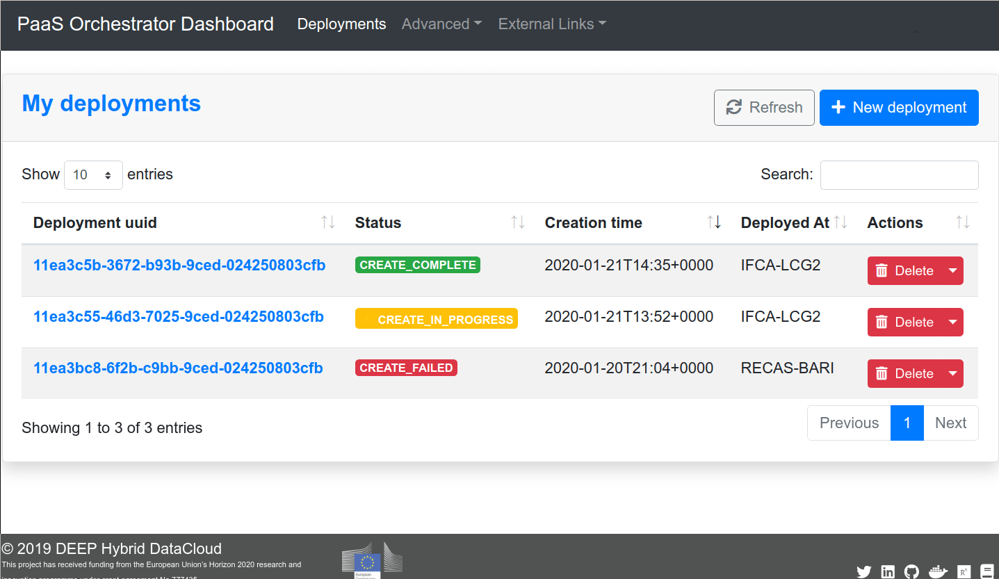

.. highlight:: console

=================
Quickstart Guide
=================

Download module from the marketplace
------------------------------------

#. go to `DEEP Open Catalog <https://marketplace.deep-hybrid-datacloud.eu/>`_
#. `Browse <https://marketplace.deep-hybrid-datacloud.eu/#model-list>`_ available modules
#. Find the module and get it either from `Docker Hub <https://hub.docker.com/u/deephdc>`_ (easy) or `Github <https://github.com/topics/deep-hybrid-datacloud>`_ (pro)

Run a module locally
--------------------

.. _docker-hub-way:

Docker Hub way (easy)
^^^^^^^^^^^^^^^^^^^^^

.. admonition:: Prerequisites

    * `docker <https://docs.docker.com/install/#supported-platforms>`_
    * If GPU support is needed:

       * you can install `nvidia-docker <https://github.com/nvidia/nvidia-docker/wiki/Installation-(version-2.0)>`_ 
         along with docker, OR
       * install `udocker <https://github.com/indigo-dc/udocker/releases>`_ instead of docker.
         `udocker <https://github.com/indigo-dc/udocker/releases>`_ is entirely a user tool, i.e. it can be installed and used without any root priveledges, e.g. in a user
         environment at HPC cluster.
       * N.B.: docker from version 19.03 has support for NVIDIA GPUs 
         (see `Release notes <https://docs.docker.com/engine/release-notes/>`_ and `moby/moby#38828 <https://github.com/moby/moby/pull/38828>`_)

1. **Run the container**

To run the Docker container directly from Docker Hub and start using the `API <https://github.com/indigo-dc/DEEPaaS>`_
simply run the following:

    Via docker command::

        $ docker run -ti -p 5000:5000 -p 6006:6006 deephdc/deep-oc-module_of_interest

    Via udocker::

        $ udocker run -p 5000:5000 -p 6006:6006 deephdc/deep-oc-module_of_interest

    With GPU support::

        $ nvidia-docker run -ti -p 5000:5000 -p 6006:6006 deephdc/deep-oc-module_of_interest
   
    If docker version is 19.03 or above::

        $ docker run -ti --gpus all -p 5000:5000 -p 6006:6006 deephdc/deep-oc-module_of_interest

    Via udocker with GPU support::

        $ udocker pull deephdc/deep-oc-module_of_interest
        $ udocker create --name=module_of_interest deephdc/deep-oc-module_of_interest
        $ udocker setup --nvidia module_of_interest
        $ udocker run -p 5000:5000 -p 6006:6006 module_of_interest

2. **Access the module via API**

To access the downloaded module via `API <https://github.com/indigo-dc/DEEPaaS>`_, direct your web browser to http://127.0.0.1:5000.
If you are training a model, you can go to http://127.0.0.1:6006 to monitor the training progress (if such monitoring is
available for the model).

For more details on particular models, please, read :doc:`model <modules/index>` documentation.

Github way (pro)
^^^^^^^^^^^^^^^^

.. admonition:: Prerequisites

   * `docker <https://docs.docker.com/install/#supported-platforms>`_

Using Github way allows to modify the Dockerfile for including additional packages, for example.

1. Clone the DEEP-OC-module_of_interest github repository::

    $ git clone https://github.com/deephdc/DEEP-OC-module_of_interest

2. Build the container::

    $ cd DEEP-OC-module_of_interest
    $ docker build -t deephdc/deep-oc-module_of_interest .

3. Run the container and access the module via API as described :ref:`above <docker-hub-way>`

.. note:: One can also clone the source code of the module, usually located in the 'module_of_interest' repository.

.. _api-integration:

Run a module on DEEP Pilot Infrastructure
-----------------------------------------

.. admonition:: Prerequisites

    * `DEEP-IAM <https://iam.deep-hybrid-datacloud.eu/>`_ registration
    * To run it via web interface:
      access `Orchestrator Dashboard <https://deep-paas.cloud.ba.infn.it/>`_  with DEEP-IAM credentials
    * To run it via command-line interface (CLI):

       * `oidc-agent <https://github.com/indigo-dc/oidc-agent/releases>`_ installed and configured for `DEEP-IAM <https://iam.deep-hybrid-datacloud.eu/>`_ (see :doc:`rclone howto <howto/oidc-agent>`).
       * `orchent <https://github.com/indigo-dc/orchent/releases>`_ tool

    If your are going to use `DEEP-Nextcloud <https://nc.deep-hybrid-datacloud.eu>`_ for storing you data you also have to:

    * Register at `DEEP-Nextcloud <https://nc.deep-hybrid-datacloud.eu>`_
    * Include `rclone <https://rclone.org/install/>`_ installation in your Dockerfile (see :doc:`rclone howto <howto/rclone>`)
    * Include call to rclone in your code (see :doc:`rclone howto <howto/rclone>`)

In order to submit your job to DEEP Pilot Infrastructure one configures job requirements by means of `TOSCA YAML file <https://github.com/indigo-dc/tosca-templates/tree/master/deep-oc>`_. 
One can either use a `general template <https://github.com/indigo-dc/tosca-templates/blob/master/deep-oc/deep-oc-mesos-webdav.yml>`_ or create a dedicated one based on the `existing ones <https://github.com/indigo-dc/tosca-templates/tree/master/deep-oc>`_.

Orchestrator Dashboard
^^^^^^^^^^^^^^^^^^^^^^
The `PaaS Orchestrator Dashboard <https://deep-paas.cloud.ba.infn.it/>`_ is an easy way to deploy an application and monitor your deployments via web interface. You login with DEEP-IAM credentials, select either application specific template or general one, *deep-oc-mesos-webdav.yml*, fill the webform and submit your job. For more details, please, see :doc:`The Dashboard <overview/architecture>`

CLI interface
^^^^^^^^^^^^^

You may also deploy an application and control your deployments from the command-line-interface. 
Similar, you could create your own TOSCA template or download and use general one, `deep-oc-mesos-webdav.yml <https://github.com/indigo-dc/tosca-templates/blob/master/deep-oc/deep-oc-mesos-webdav.yml>`_, from `here <https://github.com/indigo-dc/tosca-templates/tree/master/deep-oc>`_.

The submission is done via
::

    $ orchent depcreate ./your_module-template.yml '{}'

If you also want to access `DEEP-Nextcloud <https://nc.deep-hybrid-datacloud.eu>`_ from your container via rclone,
you can create a following bash script for job submission:

.. code-block:: bash

    #!/bin/bash

    orchent depcreate ./your_module-template.yml '{ "rclone_url": "https://nc.deep-hybrid-datacloud.eu/remote.php/webdav/",
                                                    "rclone_vendor": "nextcloud",
                                                    "rclone_user": <your_nextcloud_username>
                                                    "rclone_pass": <your_nextcloud_password> }'

To check status of your job
::

    $ orchent depshow <Deployment ID>

Integrate your model with the API
---------------------------------

.. image:: ../_static/deepaas.png

The `DEEPaaS API <https://github.com/indigo-dc/DEEPaaS>`_ enables a user friendly interaction with the underlying Deep
Learning modules and can be used both for training models and doing inference with the services.
Check the full :doc:`API guide <overview/api>` for the detailed info.

The integration with the API is based on the definition of entrypoints to the model and the creation of standard API methods
(eg. train, predict, etc).
An easy way to :ref:`integrate your model with the API <user/overview/api:Integrate your model with the API>` and create
Dockerfiles for building the Docker image is to use our :doc:`DEEP DS template <overview/cookiecutter-template>` when developing
your model.
